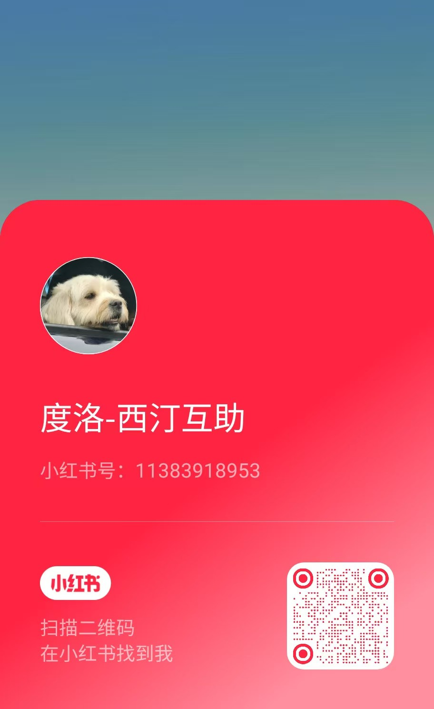
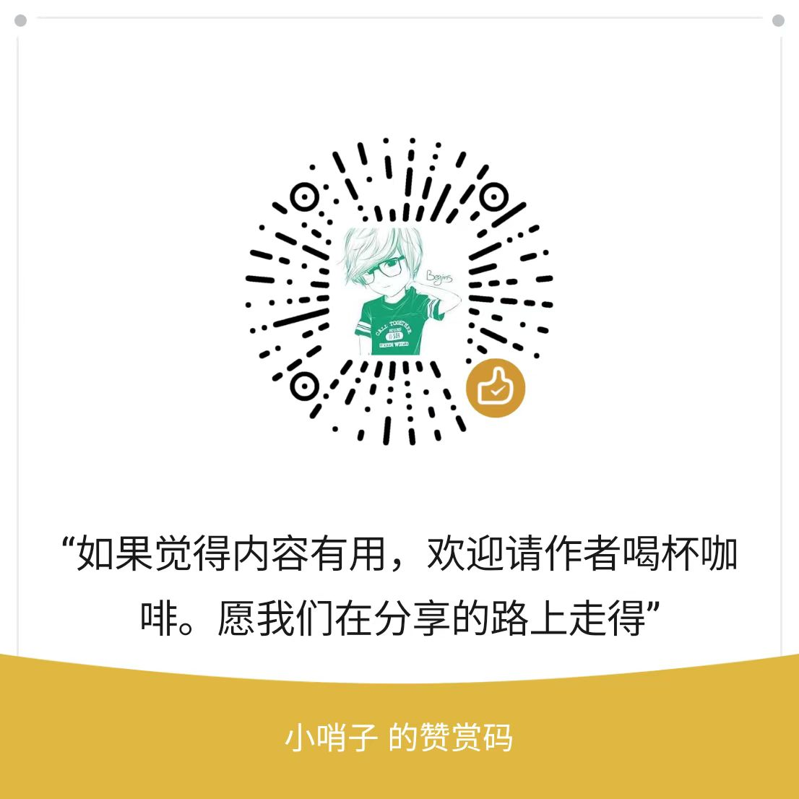

# 🫂 度洛西汀互助社区

**如果你正在吃度洛西汀（欣百达）、被副作用困扰、想减药，或觉得没人懂你——欢迎你，来这里歇一歇。**

> ⚠️ **先说最重要的事：这里的信息是病友经验分享，不是医疗建议。**
> 任何减药、停药、换药，一定要在医生指导下进行。不要突然停药。出现严重不适请立即就医。

---

## 1. 我们是谁？

我们是**患者、家属、康复者**一起建的小社区，不是医生，但都经历过同样的难。

在这里，你可以：

- 📚 **看懂药**：副作用、减药方法、国内外研究，用大白话讲清楚
- 💬 **有人懂**：分享故事、问问题、难的时候有人陪
- 🛠️ **有工具**：症状记录表、减药计划、看医生前要准备什么

> 我们的约定：不评判、只倾听；分享经验但不代替医生；可以匿名，保护隐私；相信康复是可能的。

---

## 2. 你是哪一种？对号入座，3分钟找到路

**不用从头看到尾，先看属于你的那一条。**

### A. 😷 我还在吃药，感觉不舒服 / 想了解这个药

1. [系列01 💊 度洛西汀使用者互助指南](dlx/01-why-to-start.md) — 这个药的基础知识，你不是一个人在战斗
2. [系列11a 📋 副作用识别指南](dlx/07-side-effects-complete.md) — 是病情、副作用，还是戒断反应？附需要立即就医的信号
3. [系列02 📊 90天症状追踪表](dlx/02-health-tracking.md) — 帮你和医生说清楚到底怎么了

### B. 💔 我想减药 / 正在减，好难受

1. [系列03 ⚠️ 开始前必须知道的5个真相](dlx/03-before-you-start.md) — 停药为什么这么难？要不要停？有没有替代方案？
2. [系列04 💔 为什么戒掉这么难](dlx/04-what-we-meet.md) — 科学解释 + 为什么不能“减半”“隔天吃”
3. [系列08 🔬 安全减药指南：减量原理与操作](dlx/07-safe-tapering-guide.md) — 双曲线递减法、5%原则、三种操作方法

👉 减药中很难受？直接看：

- [系列05b 💊 戒断症状应对方案](dlx/05b-withdrawal-therapies-supplements.md) — 焦虑、脑电击感、失眠、便秘怎么办
- [系列05a 🍎 营养管理指南](dlx/05a-withdrawal-nutrition-management.md) — 稳定血糖能缓解很多不适

### C. 🧡 我是家属 / 朋友 / 已经康复，想帮忙

1. [系列01 💊 使用者互助指南](dlx/01-why-to-start.md) — 先理解他在经历什么
2. [系列07 🎯 戒断症状管理：整体策略](dlx/07-withdrawal-management-strategy.md) — 全周期怎么陪，怎么不帮倒忙
3. 欢迎去[讨论区](https://github.com/careforhealth/dlx-sharing/discussions)分享你的陪伴经验

---

## 3. 新人只看这3篇就够了

脑雾、焦虑的时候看不进长文。先看这3篇，其他的等你有力气再看：

1. **了解** — [03 开始前必须知道的真相](dlx/03-before-you-start.md)（10分钟）
2. **避坑** — [06 为什么隔天吃不行？](dlx/06-why-alternate-day-fails.md)（10分钟）
3. **方法** — [08 安全减药指南](dlx/07-safe-tapering-guide.md)（25分钟，可分几次看）

> 📊 **一个真相让你安心：** 社区92人问卷里，50%以上经历过中度到极度的戒断不适，只有18.5%“没感觉”。
> 这不是你意志力差，是这个药半衰期只有12小时，确实很难停。需要慢（每次≤5%）、需要时间（常需12-24个月）、需要陪伴。这正是我们写这些指南的原因。

📚 想系统看？点开完整指南地图（共15篇，按主题分）

**一、认识药物、做决定**

- [01 使用者互助指南](dlx/01-why-to-start.md) | [💬讨论2](https://github.com/careforhealth/dlx-sharing/discussions/2)
- [03 开始前必须知道的真相](dlx/03-before-you-start.md) | [💬讨论4](https://github.com/careforhealth/dlx-sharing/discussions/4)
- [11a 副作用识别指南](dlx/07-side-effects-complete.md) | [💬讨论13](https://github.com/careforhealth/dlx-sharing/discussions/13)
- [10 20个高频问题解答](dlx/09-faq-resources.md) | [💬讨论12](https://github.com/careforhealth/dlx-sharing/discussions/12)

**二、科学减药方法（核心）**

- [04 为什么戒掉这么难](dlx/04-what-we-meet.md) | [💬讨论5](https://github.com/careforhealth/dlx-sharing/discussions/5)
- [06 为什么隔天吃不行](dlx/06-why-alternate-day-fails.md) | [💬讨论8](https://github.com/careforhealth/dlx-sharing/discussions/8)
- [08 安全减药：减量原理与操作](dlx/07-safe-tapering-guide.md) | [💬讨论10](https://github.com/careforhealth/dlx-sharing/discussions/10)
- [11d 称量减量法指南](dlx/11-weighing-method.md) | [💬讨论16](https://github.com/careforhealth/dlx-sharing/discussions/16)

**三、难受时怎么应对**

- [05a 营养管理指南](dlx/05a-withdrawal-nutrition-management.md) | [💬讨论6](https://github.com/careforhealth/dlx-sharing/discussions/6)
- [05b 应对方案：补充剂与非药物疗法](dlx/05b-withdrawal-therapies-supplements.md) | [💬讨论7](https://github.com/careforhealth/dlx-sharing/discussions/7)
- [07 戒断症状管理策略](dlx/07-withdrawal-management-strategy.md) | [💬讨论9](https://github.com/careforhealth/dlx-sharing/discussions/9)
- [09 症状管理与应对](dlx/08-symptom-management.md) | [💬讨论11](https://github.com/careforhealth/dlx-sharing/discussions/11)
- [11b 戒断症状科学应对策略](dlx/08-withdrawal-management-strategy.md) | [💬讨论14](https://github.com/careforhealth/dlx-sharing/discussions/14)
- [11c 静坐不能应对指南](dlx/10-akathisia-guide.md) | [💬讨论15](https://github.com/careforhealth/dlx-sharing/discussions/15)

**四、工具**

- [02 90天症状追踪表](dlx/02-health-tracking.md) | [💬讨论3](https://github.com/careforhealth/dlx-sharing/discussions/3)

---

## 4. 来找人说说话吧

不用自己扛着，去人多的地方问一句、留一句就行。

**📱 小红书（最推荐，新人先来这里）**

账号：**度洛-西泮互助** ｜ ID：[11383918953](https://www.xiaohongshu.com/user/11383918953)

**💙 GitHub Discussions（适合想细聊、存档经验）**

每篇文章下面都有讨论入口，你的提问和经验会被留下来，帮到后来的人。可以匿名。

👉 **你的分享，可能改变一个人的人生轨迹。**

---

## 5. 为了大家的安全，请花1分钟看完

- ✅ **欢迎：** 分享真实经历、提问、互相打气、分享靠谱资源
- ❌ **不行：** 直接给别人下“你该吃/该停”的医疗指令、推销产品、人身攻击、散布恐慌、公开别人隐私

> 🚨 **出现这些情况请立即就医，不要只在网上问：**
>
> - 剧烈不适、有伤害自己的念头
> - 静坐不能严重到无法待着
> - 疑似严重副作用

---

## 6. 如果这里帮到了你

- ⭐ 点右上角 **[Star](../../stargazers)**，让更多病友搜到我们
- 👀 点 **[Watch](../../subscription)**，有新指南会提醒你
- 📱 关注小红书合集，**关注+收藏不错过更新**
- 🍴 **[Fork](../../fork)** 或转发给需要的人

### ☕ 请作者喝杯咖啡

如果这些文字曾陪你度过难熬的夜，欢迎请作者喝杯咖啡，让我们有动力继续写下去。

感谢一路相伴 🙏

---

**康复是可能的 · 你不是一个人 · 我们陪你慢慢走** 🫂

*最后更新：2026年5月 · 有问题欢迎在 Discussions 里问*

**#度洛西汀 #互助社区 #减药经验 #用药安全 #患者权益 #心理健康**
