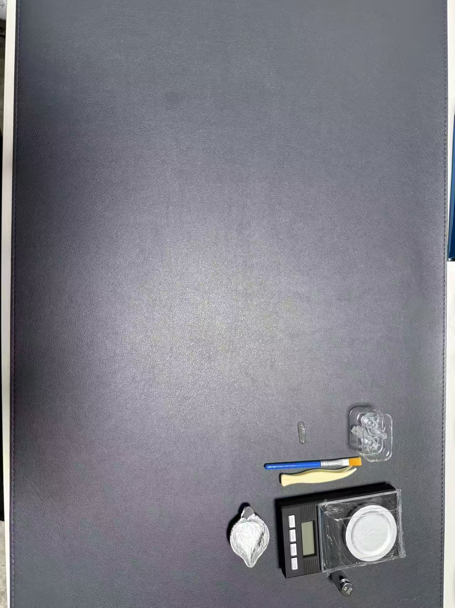
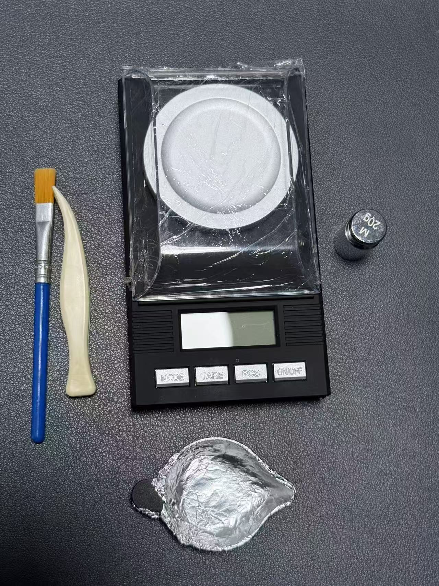
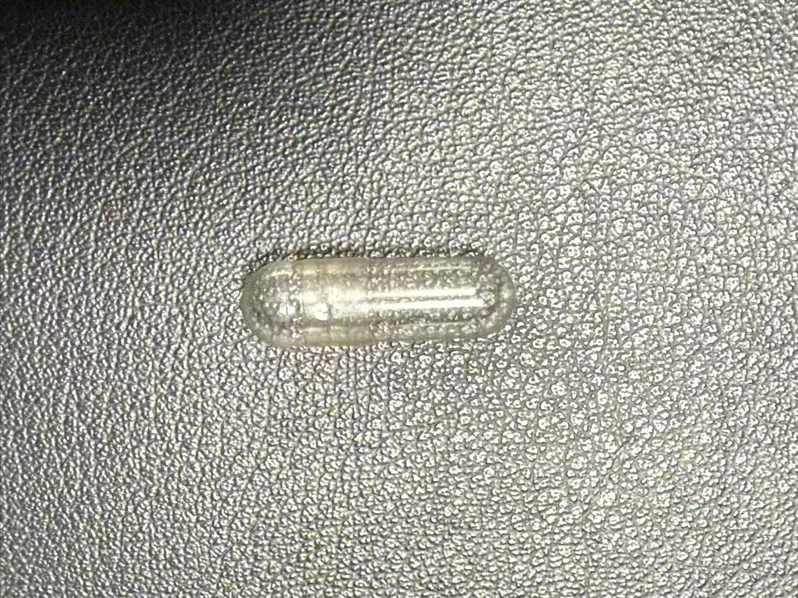
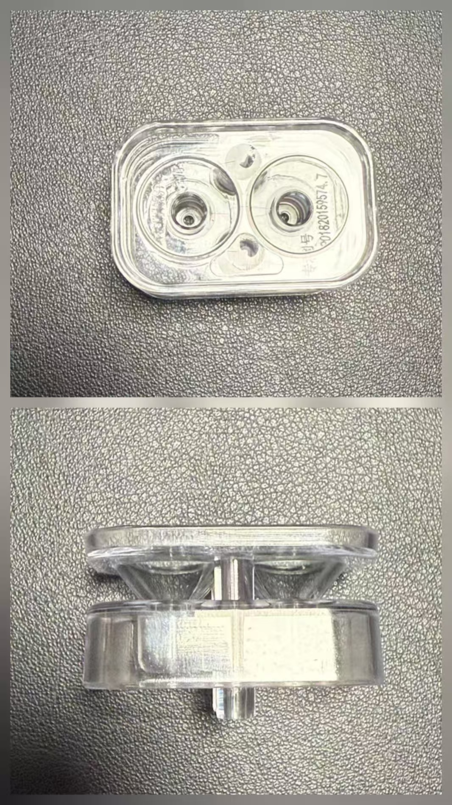

# 称量减量法：科学停药的精确方案

---

⚠️ **重要声明**

本文仅为个人经验分享，不构成医疗建议。
每个人情况不同，切勿照搬。
任何减药决定请务必咨询专业医生。
如有疑问或不适，请立即就医。

---

## 💡 什么是称量减量法

**简单说**：用精密秤称重药物颗粒，实现超精准的剂量递减。

### 核心原理

- **不是简单数微珠**（虽然低剂量时需要数颗粒）
- **而是用重量精确控制**，每次减少5%或更少
- **基于双曲线减量原理**（Hyperbolic Tapering）

### 为什么这样做？

- ✅ **减量更精确**，药物浓度波动更小
- ✅ **戒断症状更轻微**，身体更容易适应
- ✅ **大脑有充足时间重新平衡**，避免"药物震荡"
- ✅ **降低长期戒断风险**，减少复发可能

💡 **科学依据**：2025年《柳叶刀·精神病学》研究证实，缓慢减量（>12周）配合心理支持，能将复发风险降低约50%（见文末参考资源①）

---

## 🛠️ 你需要准备这些

### 必备工具清单

#### ⚖️ 精密珠宝秤
- **精度要求**：0.001克（1毫克）
- **量程建议**：0-20克
- **价格参考**：50-150元
- **注意**：必须有校准功能

#### 💊 空胶囊
- **型号**：#1号或#0号
- **材质**：透明普通胶囊
- ⚠️ **重要**：不要用肠溶胶囊！度洛西丁的微珠本身就是缓释的，不需要肠溶外壳

#### 📋 辅助工具
- **干净容器**（多备几个，装打开的颗粒以及药丸）
- **镊子**（精确夹取颗粒）
- **分药器**（方便倒入胶囊，防止珠子乱弹）
- **黑色垫子**（白色珠子在黑色背景上容易看清）
- **锡箔纸**（包托盘防静电，也可自制分药器）

#### 📱 减量计算工具
- Excel表格（自己设计）
- 或使用专业的微珠计算器（见文末资源②）

---

## 📝 详细操作步骤

### 第一步：准备工作（非常重要！）

#### 1️⃣ 校准你的秤
- 按住电源键直到显示"CAL"
- 放上校准砝码
- **每次使用前都要清零**，防止累积误差
- **每称一次都清零**，确保精确

#### 2️⃣ 消除静电（关键！）
**为什么重要**：冬天静电特别多，会让秤失准，微珠太小容易被静电影响。

**消除方法**：
- 增加环境湿度（使用加湿器）
- 穿棉质衣服（避免化纤）
- 在托盘上包一层锡箔纸（导电）
- 准备金属物品随时放电
- **在无风的室内操作**（避免气流影响）

#### 3️⃣ 使用分药器
**神器推荐**！一次可以放置多颗（我用的是两颗装），称量好后倒入胶囊更容易，不会到处乱弹。

**DIY方案**：用锡箔纸折一个小漏斗，也很好用。

#### 4️⃣ 准备垫子
- **颜色**：黑色最佳（白色珠子容易识别）
- **作用**：防止微珠撒出，方便收集

---

### 第二步：计算平均重量

📊 **操作流程**：

1. 打开**3颗**你的处方胶囊（不是1颗！）
2. 分别称重里面的颗粒
3. 计算平均值

**例如**：
- 第1颗：348mg
- 第2颗：352mg
- 第3颗：350mg
- **平均值**：350mg

💡 **为什么要3颗**？因为每颗胶囊的微珠数量可能略有差异，平均值更准确。

⚠️ **重要提醒**：你称的是"微珠总重量"，不等于"药物剂量"！微珠外面有包衣和辅料。

---

### 第三步：设置减量参数

在计算器中输入：

| 参数 | 建议值 | 说明 |
|------|--------|------|
| **当前剂量** | 例：60mg | ⚠️ 注意是药物剂量，不是微珠重量 |
| **减量比例** | 5% | 初次建议，可根据反应调整为3%-10% |
| **减量周期** | 14天 | 每次减量后观察期，可调整为14-28天 |

💊 **剂量与重量的关系**：
- 60mg度洛西丁 ≈ 350mg微珠（含辅料）
- 比例约为 1:5.8

计算器会告诉你每次该称多少克微珠。

---

### 第四步：精确称量和装胶囊

#### ⚖️ 称量步骤

1. **打开胶囊**，颗粒倒进小碗
2. **清零秤**
3. 用镊子/分药器夹取颗粒到秤上
4. **接近目标值时放慢**，一颗一颗加
5. 达到目标重量

💡 **精度技巧**：
- 可以多次拿起托盘，摇匀后再称，确认重量
- 轻微差异（±0.001g，即1毫克）不用太介意
- 宁可少一点，不要多（保守更安全）

#### 💊 装胶囊

1. 把称好的颗粒小心倒进空胶囊（用分药器）
2. 盖上顶部
3. **标记日期和剂量**（用记号笔写在装做好的胶囊容器上，不要忘记哦）
4. 完成！

---

## ⚠️ 超重要的注意事项

### 🔴 重量 ≠ 剂量（必须理解！）

**你称的是**："微珠总重量"（含包衣、辅料）
**不是**："纯药物剂量"

**这是两回事，千万别搞混！**

**例如**：
- 60mg剂量 ≠ 60mg微珠重量

---

### 📉 低剂量时要改方法

**临界点**：当减到约**20mg剂量**以下

**为什么要改**：秤的精度不够了，1颗微珠的重量误差就可能很大

**改用方法**：**数微珠法**
- 先数出3颗胶囊的平均微珠数量
- 例如：每颗约200粒
- 然后每次减少固定数量的微珠（如10粒=5%）

💡 **参考资源**：见文末资源③（数微珠详细教程）

---

### ⏰ 倾听你的身体（最重要！）

如果出现戒断症状（头痛、眩晕、恶心、焦虑加重等）：

**调整策略**：

1. **延长等待时间**
   - 14天 → 21天
   - 21天 → 28天

2. **降低减量比例**
   - 5% → 3%
   - 3% → 2%
   - 甚至1%

3. **暂停减量**
   - 在当前剂量稳定2-4周
   - 等身体完全适应后再继续

**记住**：没有标准答案，你的身体会告诉你。慢不是失败，稳才是胜利。

---

## 💪 实用建议

### ✨ 慢慢来，别着急

这是**马拉松，不是冲刺**

- 国外案例：成功停药平均需要**6-12个月**甚至更长
- 快了反而更痛苦，可能导致严重戒断
- 你的节奏，就是最好的节奏

### 📊 详细记录每次减量

可以参考之前发的 📊 **度洛西丁互助指南 · 系列02** 用药必备！这张表帮我追踪90天，终于看清真相了

**建议记录**：
- 日期
- 剂量（药物mg）
- 微珠重量（mg）
- 身体反应（症状评分1-10）
- 情绪状态
- 睡眠质量

**工具**：
- Excel表格
- 纸质日记

💡 **为什么重要**：记录能帮你识别模式，调整策略。

### 🤝 寻求支持

**你不是一个人**：

- 家人的理解和陪伴
- 加入患者互助社群（小红书、豆瓣）
- 定期复诊，向医生汇报进展
- 考虑心理咨询（研究显示配合心理支持成功率更高）

### 🎯 调整是正常的

**每个人代谢不同**：

- 有人5%很舒适
- 有人需要2%才稳定
- 找到适合自己的节奏就好

**不要和别人比**：
- 别人快不代表你也要快
- 你慢不代表你做错了
- 安全停药比快速停药重要1000倍

---

## 🌟 为什么这个方法有效

### 科学依据

**国外十年经验证明**：**缓慢、精确、渐进**的减量能让大多数人成功停药。

**2025最新研究**（见文末资源①）显示：
- 缓慢减量（>12周）配合心理支持
- 复发风险降低约50%
- 戒断症状明显减轻

### 生理机制

**关键在于**：

- ✅ **给神经系统足够时间重新平衡**
  - SNRI类药物（度洛西丁属于此类）影响5-羟色胺和去甲肾上腺素
  - 大脑需要时间重新调整这些神经递质的平衡

- ✅ **避免突然的药物浓度波动**
  - 突然停药=药物浓度断崖式下降
  - 缓慢减量=平滑的浓度曲线

- ✅ **减少"药物震荡"反应**
  - 戒断症状与剂量下降速度成正比
  - 慢速下降=症状更轻微

💡 **专业术语**：这叫"双曲线减量"（Hyperbolic Tapering），是目前国际认可的最佳实践。

---

## 💬 你的经验很重要

你用过称量法吗？或者正在考虑尝试？

**评论区聊聊**：
- 你的减药进度
- 遇到的挑战
- 有效的小技巧
- 想问的问题

**我们一起学习，互相支持** 💪

---

## 💌 最后想说的话

**记住**：

🌸 **慢不是失败，稳才是胜利**

🌸 **你的节奏，就是最好的节奏**

🌸 **成功停药的定义是：安全、舒适、可持续**

🌸 **这不是比赛，没有人给你计时**

---

## 📚 专业资源参考

**本文内容基于以下专业资源**（因平台限制，链接无法直接点击，可复制到浏览器查看）：

---

### ① 2025年最新研究

**《柳叶刀·精神病学》抗抑郁药减量研究**
证实缓慢减量配合心理支持能降低50%复发风险

链接：
medicalxpress.com/news/2025-12-tapering-therapy-effective-strategy-antidepressants.html

---

### ② 微珠计算工具

**Bead Counting Calculator（微珠计数计算器）**
可以帮助计算每次减量需要的微珠数量

链接：
www.healingamericanow.com/calculator.php

---

### ③ 数微珠详细教程

**Inner Compass Initiative - 数微珠指南**
低剂量时如何数微珠的详细教程

链接：
www.theinnercompass.org/taper/counting-beads-beaded-capsule

---

### ④ SNRI减药专业技术

**Psychopharmacology Institute - 双曲线减量技术**
专业的SNRI类药物（度洛西丁属于此类）减药指南

链接：
psychopharmacologyinstitute.com/section/deprescribing-snris-hyperbolic-tapering-techniques/

---

### ⑤ 度洛西丁减药手册

**Cymbalta Withdrawal - 欣百达减药手册**
专门针对度洛西丁（欣百达）的减药指南

链接：
cymbalta-withdrawal.com/cymbalta-tapering-handbook/

---

### ⑥ 精密秤使用指南

**Inner Compass Initiative - 精密秤使用方法**
如何使用精密秤进行称量的详细教程

链接：
www.theinnercompass.org/taper/using-digital-scale-weighing-and-making-cuts

---

### ⑦ 称量法详细指南

**Tapering by Counting Beads - 微珠减量法**
称量和数微珠的综合指南

链接：
healthwithoutantidepressants.com/tapering-by-counting-beads/

---

### ⑧ 美国精神病学新闻

**抗抑郁药戒断症状研究**
关于戒断症状的专业医学分析

链接：
psychiatryonline.org/doi/full/10.1176/appi.pn.2025.09.9.1

---

**💡 使用建议**：
- 这些都是国外专业资源（英文）
- 可以用浏览器自带的翻译功能
- 或者在评论区提问，我帮你解答

---

## ⚠️ 再次提醒

本文仅为个人用药经验分享，不构成医疗建议。

⚠️ 涉及药物请务必咨询医生——不同药物间存在相互作用、副作用及戒断风险差异。

⚠️ 任何减药/换药决策必须在医生指导下进行，结合专业意见和自身情况综合判断，切勿轻易调整用药。

⚠️ 本人不对因参考本文而做出的用药决定承担任何责任。

---

💡 因为小红薯的推流方式，点个**关注**才能收到推送，不错过分享～

💡 记得**收藏合集**，找起来更方便

---

#度洛西丁 #停药经验 #称量减量法 #科学停药 #减药攻略 #戒断症状 #欣百达 #患者互助 #抗抑郁药 #双曲线减量 #精神科用药
